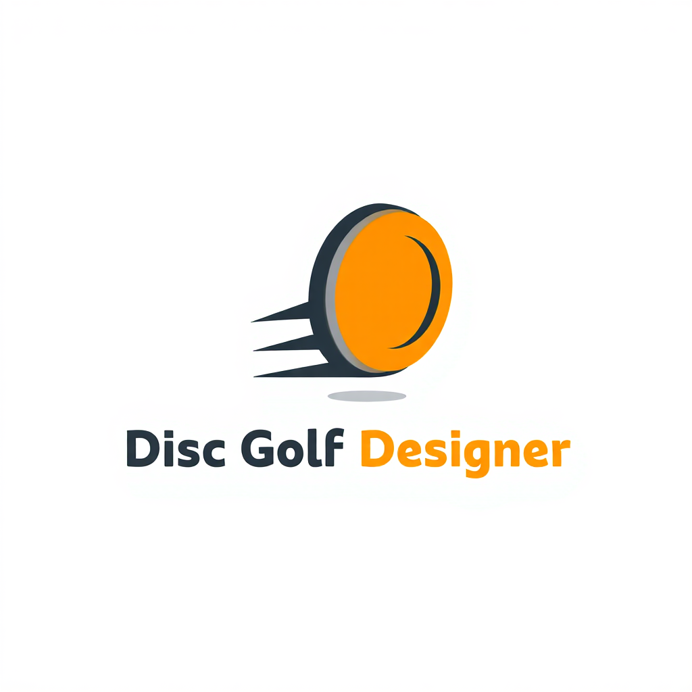

<div align="center">
  
  <h1>Disc Golf Designer Pro</h1>
</div>

A professional, industry-grade disc golf design tool built with Python and Streamlit. Create PDGA-compliant disc designs with real-time visualization, interactive controls, and 3D model generation.

<div align="center">

[](https://disc-golf-designer.streamlit.app)


</div>

---

<div align="center">
  
  <br>
  <em>Experience professional disc design with real-time visualization and PDGA compliance validation!</em>
</div>

---

## Features

### 🎯 **Core Functionality**
- **7-Point Control System**: Interactive control points with proper geometric constraints
- **Real-time Validation**: PDGA compliance checking with instant feedback
- **Spline Curves**: Bezier curves between control points with tangent control
- **Professional Visualization**: Interactive 2D cross-section and top-view displays
- **3D Model Generation**: Export STL files for 3D printing or CAD

### 📏 **PDGA Compliance**
- Diameter: 210-230mm validation
- Height: 10-30mm validation
- Weight: 150-180g estimation and validation
- Rim specifications: Depth (5-25mm) and Width (10-25mm)
- Flight plate thickness: 1-4mm recommendations

### 🎨 **Professional UI/UX**
- Clean, modern interface with gradient styling
- Hover tooltips for all parameters
- Color-coded validation (errors in red, warnings in yellow, success in green)
- Responsive design with sidebar controls
- Professional metric cards and status indicators

### 🔧 **Control Points System**
1. **Flight Plate Top** (Origin, Fixed)
2. **Shoulder** (Adjustable with constraints)
3. **Nose** (Leftmost point, adjustable)
4. **Lower Rim Profile** (Adjustable with constraints)
5. **Rim Bottom** (Bottommost point, adjustable)
6. **Rim Wall** (Adjustable with constraints)
7. **Flight Plate Bottom** (Fixed X, adjustable Y)

### 📊 **Calculations**
- **Radius & Diameter**: Distance from center to nose
- **Flight Plate Thickness**: Distance between top and bottom plates
- **Total Disc Thickness**: Overall height of the disc
- **Weight Estimation**: Based on volume calculation and plastic density
- **Rim Dimensions**: Depth and width measurements

## 🌐 Live Application

**Try it now!** 🔗 **[disc-golf-designer.streamlit.app](https://disc-golf-designer.streamlit.app)**

No installation required - use the live web application instantly!

## 💻 Local Installation

1. **Clone or download the project files**:
   ```bash
   git clone https://github.com/bin2ai/disc-golf-designer.git
   cd disc-golf-designer
   ```

2. **Install Python dependencies**:
   ```bash
   pip install -r requirements.txt
   ```

## 🚀 Usage

### Online (Recommended)
Visit **[disc-golf-designer.streamlit.app](https://disc-golf-designer.streamlit.app)** and start designing immediately!

### Local Development
1. **Start the application**:
   ```bash
   streamlit run app.py
   ```

2. **Open your browser** to the displayed URL (usually `http://localhost:8501`)

### Design Your Disc
   - Use the sidebar controls to adjust control points
   - Modify curve parameters for smooth transitions
   - Watch real-time validation and calculations
   - Export 3D models when satisfied with your design

## Control Point Constraints

The application enforces realistic geometric constraints:

- **Point 2 (Shoulder)**: Must be left of Point 1, right of Point 3, below Point 1, above Point 3
- **Point 3 (Nose)**: Leftmost point, must be left of Point 2, below Point 2, above Point 4
- **Point 4 (Lower Rim)**: Must be right of Point 3, left of Point 5, below Point 3, above Point 5
- **Point 5 (Rim Bottom)**: Bottommost point, must be right of Point 4, left of Point 6, below Point 4
- **Point 6 (Rim Wall)**: Must be right of Point 5, left of Point 1, below Point 2, above Point 3
- **Point 7 (Flight Plate Bottom)**: Must be above Point 2, below Point 1

## Curve System

- **Bezier Curves**: Smooth transitions between all adjacent points (except 1↔7)
- **Straight Line**: Points 1 and 7 are connected with a straight line (flight plate edge)
- **Boundary Validation**: Curves cannot exceed the boundaries of their control points
- **Tangent Control**: Adjust curve strength and angle for precise shaping

## Export Options

- **STL Files**: Generate 3D printable models
- **CSV Specifications**: Export detailed measurements
- **Real-time Validation**: Instant PDGA compliance checking

## Technical Details

- **Framework**: Streamlit for web interface
- **Visualization**: Plotly for interactive charts
- **3D Generation**: numpy-stl for STL file creation
- **Mathematics**: NumPy and SciPy for calculations
- **Styling**: Custom CSS for professional appearance

## PDGA Standards Reference

The application validates against official PDGA disc specifications:
- Maximum diameter: 230mm
- Minimum diameter: 210mm  
- Maximum height: 30mm
- Minimum height: 10mm
- Weight range: 150-180g

## File Structure

```
disc_golf_designer/
├── disc_designer.py      # Main application
├── requirements.txt      # Python dependencies
└── README.md            # This file
```

## Support

For issues or feature requests, please refer to the application's built-in help tooltips and validation messages.

---

**Built with ❤️ for the disc golf community**